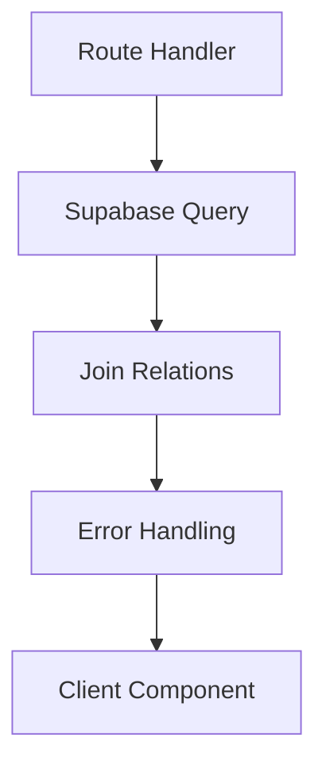
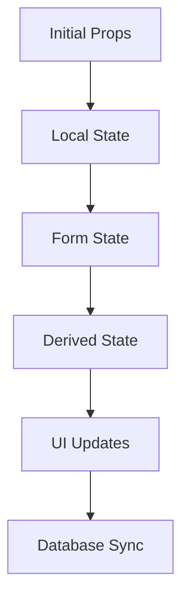
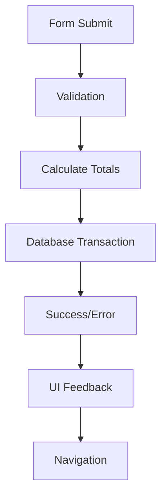

# Purchase Orders Component Architecture

## Overview
Comprehensive documentation of the Purchase Orders module component structure, data flow, and architectural patterns.

## Component Hierarchy

```
app/portal/purchase-orders/
├── page.tsx                                    # Main route (list view)
├── purchase-orders-list.tsx                    # List component with filtering
├── new/
│   ├── page.tsx                               # New PO route  
│   └── NewPurchaseOrderClientPage.tsx         # Creation form
├── [id]/
│   ├── page.tsx                               # View route
│   ├── PurchaseOrderViewClientPage.tsx        # Details view
│   ├── edit/
│   │   ├── page.tsx                           # Edit route
│   │   └── PurchaseOrderEditClientPage.tsx    # Edit form
│   └── pdf/
│       ├── page.tsx                           # PDF route
│       └── PurchaseOrderPdfClientPage.tsx     # PDF generation
└── __tests__/                                 # Test files

components/purchase-orders/
├── POCompletionModal.tsx                      # Status completion modal
└── __tests__/                                 # Component tests
```

## Component Details

### 1. Main Route (`page.tsx`)
**Purpose**: Server-side data fetching and layout  
**Type**: Server Component  
**Size**: 55 lines  

**Key Features**:
- Fetches purchase orders with company relations
- Implements `dynamic = 'force-dynamic'` for real-time data
- Error handling with fallback empty array
- Server-side join queries for performance

**Data Flow**:
```typescript
async function getPurchaseOrders() {
  const { data, error } = await supabase
    .from('purchase_orders')
    .select(`
      po_id, po_number, po_date, status, total_amount, created_at,
      my_companies (my_company_name, my_company_code),
      companies (company_name, company_code)
    `)
    .order('created_at', { ascending: false })
}
```

### 2. Purchase Orders List (`purchase-orders-list.tsx`)
**Purpose**: Interactive list with search and filtering  
**Type**: Client Component  
**Size**: 248 lines  

**Key Features**:
- Real-time search across PO number and company names
- Status-based filtering with dropdown
- Client-side delete operations with confirmation
- Responsive card layout with action buttons
- Optimistic UI updates

**State Management**:
```typescript
const [purchaseOrders, setPurchaseOrders] = useState<PurchaseOrder[]>()
const [filteredPOs, setFilteredPOs] = useState<PurchaseOrder[]>()  
const [searchTerm, setSearchTerm] = useState('')
const [statusFilter, setStatusFilter] = useState<string>('all')
```

**Performance Optimizations**:
- Debounced search with useEffect
- Client-side filtering for instant feedback
- Optimistic updates for delete operations

### 3. New Purchase Order (`NewPurchaseOrderClientPage.tsx`)
**Purpose**: Complex form for creating purchase orders  
**Type**: Client Component  
**Size**: 912 lines  

**Architecture Issues** ⚠️:
- **Oversized Component**: 912 lines exceeds maintainability threshold
- **Mixed Responsibilities**: Form logic, business rules, and UI rendering
- **Complex State**: 15+ form fields with interdependencies

**Key Features**:
- React Hook Form with Zod validation
- Dynamic line items with useFieldArray
- Real-time total calculations
- Ship-to company selection with address display
- Auto-populated user information

**Form Schema**:
```typescript
const purchaseOrderSchema = z.object({
  my_company_id: z.string().min(1),
  vendor_company_id: z.string().min(1),
  po_date: z.date(),
  currency: z.enum(['USD', 'EURO', 'TL', 'GBP']),
  items: z.array(poItemSchema).min(1),
  // ... 10+ additional fields
})
```

### 4. Edit Purchase Order (`PurchaseOrderEditClientPage.tsx`)
**Purpose**: Edit existing purchase orders  
**Type**: Client Component  
**Size**: 1,166 lines ⚠️  

**Critical Issues**:
- **Massive Component**: Largest file in module at 1,166 lines
- **Debug Logging**: 43 console.error statements with sensitive data
- **Complex Form Logic**: Delete-and-recreate pattern for line items
- **Status-Specific Workflows**: Completion modal integration

**Data Flow Pattern**:
```typescript
// Problem: Delete-and-recreate instead of differential updates
const updatePurchaseOrder = async (data) => {
  // 1. Update main PO record
  await supabase.from('purchase_orders').update(...).eq('po_id', poId)
  
  // 2. Delete ALL existing line items
  await supabase.from('po_items').delete().eq('po_id', poId)
  
  // 3. Insert ALL line items as new
  await supabase.from('po_items').insert(lineItems)
}
```

### 5. View Purchase Order (`PurchaseOrderViewClientPage.tsx`)
**Purpose**: Read-only display of purchase order details  
**Type**: Client Component  
**Size**: 492 lines  

**Key Features**:
- Comprehensive PO details with company information
- Ship-to information display logic
- Cost breakdown with traceability notice
- Action buttons (Edit, PDF, Delete)
- Responsive layout with conditional rendering

### 6. PDF Generation (`PurchaseOrderPdfClientPage.tsx`)
**Purpose**: Generate PDF version of purchase order  
**Type**: Client Component  
**Dependencies**: React-PDF or similar library  

### 7. Completion Modal (`POCompletionModal.tsx`)
**Purpose**: Handle PO completion workflow  
**Type**: Client Component  
**Size**: 270 lines  

**Key Features**:
- Preview of items to be created in inventory
- Inventory conflict detection
- Status validation before completion
- Loading states and error handling

## Data Flow Architecture

### 1. Server-Side Data Fetching


### 2. Client-Side State Management


### 3. Form Submission Flow


## State Management Patterns

### 1. Server State
- Fetched via Supabase in server components
- Passed down as initial props
- Managed with real-time subscriptions where needed

### 2. Client State
- React Hook Form for form state
- useState for UI state (filters, modals)
- Derived state for calculations and filtering

### 3. Form State Architecture
```typescript
// Form initialization
const form = useForm<PurchaseOrderFormValues>({
  resolver: zodResolver(purchaseOrderSchema),
  defaultValues: {
    items: [{ /* default item */ }]
  }
})

// Dynamic arrays
const { fields, append, remove } = useFieldArray({
  control: form.control,
  name: 'items'
})

// Real-time calculations
const calculateTotal = () => {
  const subtotal = form.watch('items').reduce(...)
  const freight = form.watch('freight_charge') || 0
  // ... calculation logic
}
```

## Performance Considerations

### Current Issues
1. **Large Component Re-renders**: 900+ line forms trigger full re-renders
2. **Unoptimized Calculations**: Total calculations run on every keystroke
3. **Client-Side Filtering**: No virtualization for large PO lists
4. **Database Operations**: N+1 queries for related data

### Optimization Opportunities
1. **Component Splitting**: Break large forms into smaller components
2. **Memoization**: React.memo for expensive components, useMemo for calculations
3. **Debouncing**: Delay calculations and API calls
4. **Virtualization**: For large lists (>100 items)
5. **Batch Operations**: Bulk database operations

## Error Handling Patterns

### 1. Form Validation
```typescript
// Client-side validation with Zod
const { formState: { errors } } = form

// Display errors in UI
{errors.my_company_id && (
  <div className="text-red-500">
    {errors.my_company_id.message}
  </div>
)}
```

### 2. Database Operations
```typescript
try {
  const { data, error } = await supabase.from('purchase_orders')...
  if (error) throw error
  return data
} catch (error) {
  console.error('Database error:', error)
  toast.error('Operation failed')
}
```

### 3. Network Errors
```typescript
// Timeout handling
const timeoutPromise = new Promise((_, reject) => {
  setTimeout(() => reject(new Error('Operation timed out')), 30000)
})

await Promise.race([operation(), timeoutPromise])
```

## Security Architecture

### 1. Authentication
- All components require valid Supabase session
- Authentication checked at route level
- Client components verify auth state

### 2. Authorization
- Row Level Security (RLS) policies on database
- Client-side role checks for UI elements
- Server-side permission validation

### 3. Input Validation
- Zod schemas for type safety and validation
- SQL injection prevention through Supabase client
- XSS prevention through React's built-in sanitization

## Testing Architecture

### 1. Unit Tests
- Component rendering tests
- Form validation tests  
- Utility function tests
- Mock Supabase client

### 2. Integration Tests
- Form submission flows
- Database operation tests
- Error scenario handling

### 3. E2E Tests (Playwright)
- Complete user workflows
- Cross-browser compatibility
- PDF generation testing

## Recommendations for Improvement

### 1. Component Refactoring
```typescript
// Current: Monolithic form component (1,166 lines)
<PurchaseOrderEditClientPage />

// Proposed: Modular component structure
<PurchaseOrderEditPage>
  <POHeader />
  <CompanyInformation />
  <ShipToSection />
  <LineItems />
  <CostSummary />
  <Actions />
</PurchaseOrderEditPage>
```

### 2. State Management Enhancement
```typescript
// Current: Multiple useState hooks
const [po, setPO] = useState()
const [items, setItems] = useState()
const [totals, setTotals] = useState()

// Proposed: Unified state with reducer
const [state, dispatch] = useReducer(poReducer, initialState)
```

### 3. Performance Optimization
```typescript
// Memoized calculations
const totals = useMemo(() => calculateTotals(items), [items])

// Debounced API calls
const debouncedSave = useCallback(
  debounce(savePurchaseOrder, 1000),
  []
)
```

---

**Architecture Version**: 1.0  
**Last Updated**: January 2025  
**Review Status**: Needs refactoring for maintainability