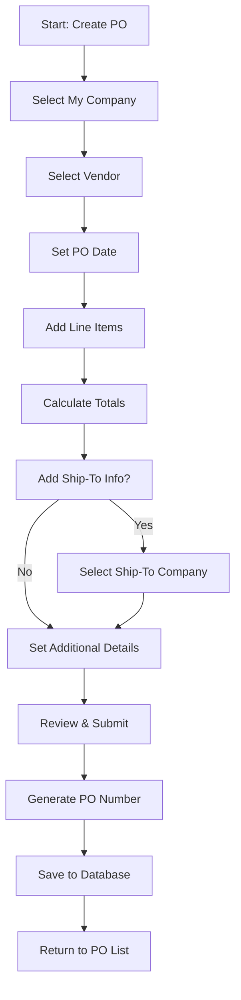
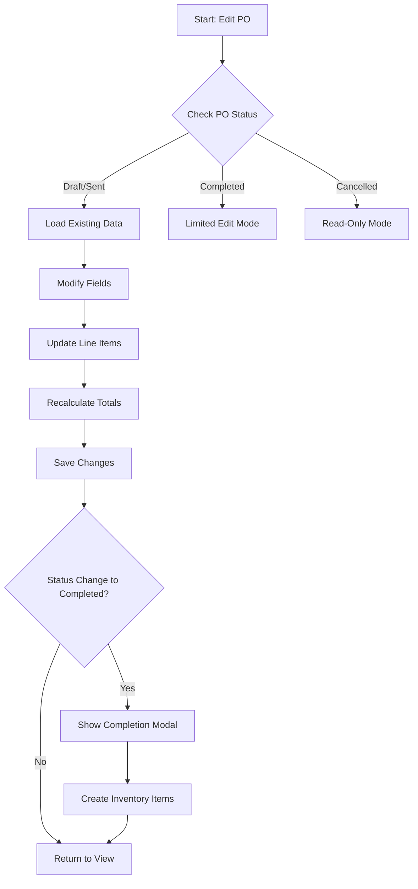
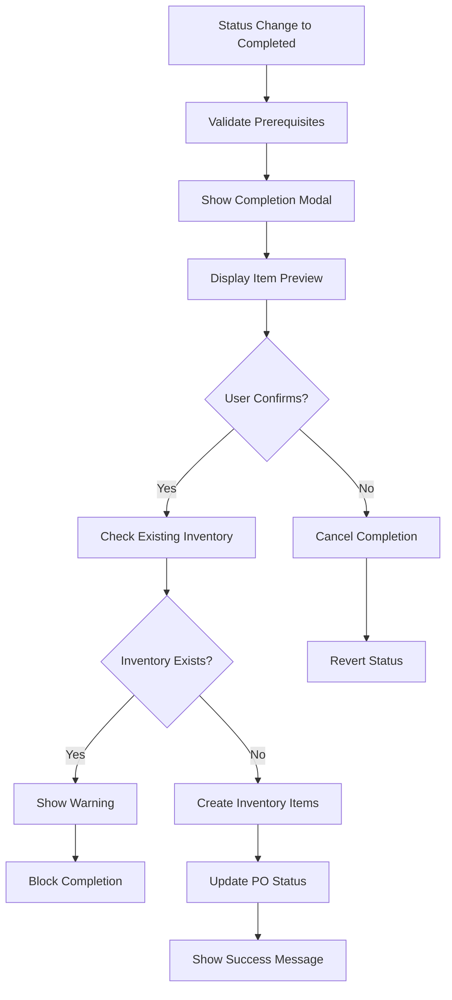
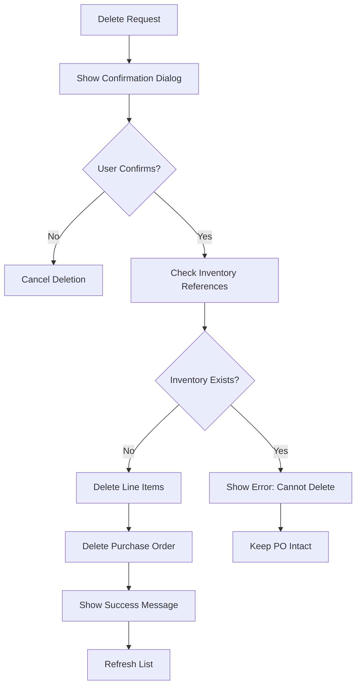

# Purchase Order Workflows & Business Logic

## Overview
Comprehensive documentation of business workflows, processes, and logic for the TASAVIA Purchase Order system.

## Table of Contents
- [Core Workflows](#core-workflows)
- [Status Management](#status-management)
- [Business Rules](#business-rules)
- [Integration Points](#integration-points)
- [Error Scenarios](#error-scenarios)

## Core Workflows

### 1. Purchase Order Creation Workflow



**Detailed Steps**:

1. **Company Selection**
   - User selects from "My Companies" dropdown
   - System loads company address and contact information
   - Filters Ship Via options based on company ownership

2. **Vendor Selection**
   - User selects from external companies database
   - System loads vendor address and contact details
   - Validates vendor is active and available

3. **Line Item Management**
   - Add items with part number lookup
   - Auto-populate description from part master
   - Validate quantity (>0) and unit price (>=0)
   - Calculate line totals in real-time

4. **Cost Calculations**
   ```typescript
   const subtotal = items.reduce((sum, item) => 
     sum + (item.quantity * item.unit_price), 0
   )
   const vatAmount = subtotal * (vat_percentage / 100)
   const total = subtotal + freight_charge + misc_charge + vatAmount
   ```

5. **PO Number Generation**
   - Format: P{YY}{sequence} (e.g., P25001)
   - Year-based sequence with auto-increment
   - Guaranteed uniqueness through database function

### 2. Purchase Order Edit Workflow



**Business Rules**:
- **Draft Status**: Full editing capabilities
- **Sent Status**: Limited editing, no structural changes
- **Acknowledged**: Minimal editing, status progression only
- **Completed**: Very limited editing, mainly status and notes
- **Cancelled**: Read-only, archived state

### 3. Purchase Order Completion Workflow



**Inventory Creation Logic**:
```sql
-- For each line item in completed PO
INSERT INTO inventory (
  pn_id,
  quantity,
  unit_cost,
  condition,
  po_id_original,
  po_number_original,
  received_date,
  status
) VALUES (
  line_item.pn_id,
  line_item.quantity,
  line_item.unit_price,
  line_item.condition,
  po.po_id,
  po.po_number,
  CURRENT_DATE,
  'Available'
)
```

### 4. Purchase Order Deletion Workflow



**Referential Integrity Checks**:
```sql
-- Check for inventory references
SELECT COUNT(*) FROM inventory 
WHERE po_id_original = $po_id;

-- If count > 0, prevent deletion
-- Otherwise, proceed with cascade delete
```

## Status Management

### Status Definitions

| Status | Description | Allowed Actions | Next States |
|--------|-------------|-----------------|-------------|
| **Draft** | Initial creation state | Full editing, deletion | Sent, Cancelled |
| **Sent** | Sent to vendor | Limited editing | Acknowledged, Cancelled |
| **Acknowledged** | Vendor confirmed | Status updates only | Completed, Cancelled |
| **Completed** | Fulfilled, inventory created | Minimal editing | - |
| **Cancelled** | Archived/cancelled | Read-only | - |

### Status Validation Rules

```typescript
const statusTransitions = {
  Draft: ['Sent', 'Cancelled'],
  Sent: ['Acknowledged', 'Cancelled'], 
  Acknowledged: ['Completed', 'Cancelled'],
  Completed: [], // Terminal state
  Cancelled: []  // Terminal state
}

function validateStatusChange(currentStatus: string, newStatus: string): boolean {
  return statusTransitions[currentStatus]?.includes(newStatus) ?? false
}
```

### Status-Specific UI Behavior

```typescript
const getStatusCapabilities = (status: string) => {
  switch (status) {
    case 'Draft':
      return {
        canEdit: true,
        canDelete: true,
        canChangeStatus: true,
        editRestrictions: []
      }
    case 'Sent':
      return {
        canEdit: true,
        canDelete: false,
        canChangeStatus: true,
        editRestrictions: ['line_items', 'vendor']
      }
    case 'Completed':
      return {
        canEdit: false,
        canDelete: false, 
        canChangeStatus: false,
        editRestrictions: ['all']
      }
    // ... other cases
  }
}
```

## Business Rules

### 1. Company Management Rules

**My Companies**:
- Must have at least one address and contact
- Company code must be unique across system
- Cannot delete if referenced in active POs

**External Companies**:
- Can be vendors, customers, or both
- Ship-to companies can be either type
- Archive instead of delete if referenced

### 2. Part Number Rules

**Master Part Table**:
- Part numbers must be unique
- Description recommended but not required
- Cannot delete if used in POs or inventory

**Line Item Validation**:
- Part number is mandatory for each line item
- Quantity must be positive integer
- Unit price must be non-negative
- Condition codes from predefined list

### 3. Financial Rules

**Currency Handling**:
- Support for USD, EUR, GBP, TL
- All calculations in selected currency
- No automatic conversion between currencies

**Cost Calculations**:
- Subtotal = Sum of (quantity × unit_price) for all line items
- VAT Amount = Subtotal × (VAT % / 100)
- Total = Subtotal + Freight + Misc Charges + VAT Amount

**Validation Rules**:
```typescript
const financialValidation = {
  freight_charge: { min: 0, max: 999999.99 },
  misc_charge: { min: 0, max: 999999.99 },
  vat_percentage: { min: 0, max: 100 },
  unit_price: { min: 0, max: 9999999.99 },
  quantity: { min: 1, max: 99999 }
}
```

### 4. Workflow Rules

**Creation Rules**:
- Minimum one line item required
- My company and vendor must be different
- PO date cannot be in future beyond 30 days
- Prepared by automatically set to current user

**Modification Rules**:
- Status changes follow defined workflow
- Completed POs create inventory automatically
- Cancelled POs cannot be reactivated
- Line item modifications recalculate totals

## Integration Points

### 1. Inventory Integration

**Automatic Inventory Creation**:
```typescript
const createInventoryFromPO = async (poId: string) => {
  // Get PO line items
  const { data: lineItems } = await supabase
    .from('po_items')
    .select('*')
    .eq('po_id', poId)

  // Create inventory record for each line item
  const inventoryItems = lineItems.map(item => ({
    pn_id: item.pn_id,
    quantity: item.quantity,
    unit_cost: item.unit_price,
    condition: item.condition,
    po_id_original: poId,
    received_date: new Date().toISOString(),
    status: 'Available'
  }))

  await supabase.from('inventory').insert(inventoryItems)
}
```

**Inventory Conflict Prevention**:
- Check for existing inventory before completion
- Prevent duplicate inventory creation
- Handle partial completions appropriately

### 2. Company Directory Integration

**Address Synchronization**:
- Company addresses used for ship-to information
- Real-time address validation and formatting
- Contact information propagation

**Ship Via Integration**:
- Filter shipping companies by ownership
- Account number validation
- Tracking integration preparation

### 3. Audit Trail Integration

**Change Tracking**:
```sql
-- Admin actions table logs all PO modifications
INSERT INTO admin_actions (
  admin_id,
  target_resource_id,
  action_type,
  details,
  ip_address,
  user_agent
) VALUES (
  $user_id,
  $po_id,
  'PO_MODIFIED',
  $change_details,
  $ip_address,
  $user_agent
)
```

## Error Scenarios & Recovery

### 1. Data Consistency Errors

**Orphaned Line Items**:
```sql
-- Detection query
SELECT poi.* FROM po_items poi
LEFT JOIN purchase_orders po ON poi.po_id = po.po_id
WHERE po.po_id IS NULL;

-- Recovery: Delete orphaned items or restore parent PO
```

**Missing Company References**:
```sql
-- Detection query
SELECT po.* FROM purchase_orders po
LEFT JOIN my_companies mc ON po.my_company_id = mc.my_company_id
WHERE mc.my_company_id IS NULL;

-- Recovery: Fix company reference or mark PO as invalid
```

### 2. Business Logic Violations

**Status Inconsistency**:
- Completed POs without inventory
- Inventory existing for non-completed POs
- Invalid status transitions

**Calculation Mismatches**:
- Stored totals not matching line item sums
- VAT calculations with precision errors
- Currency conversion inconsistencies

### 3. Concurrency Issues

**Simultaneous Edits**:
```typescript
// Optimistic locking with version checking
const updatePO = async (poId: string, updates: any, expectedVersion: number) => {
  const { data, error } = await supabase
    .from('purchase_orders')
    .update({
      ...updates,
      version: expectedVersion + 1,
      updated_at: new Date().toISOString()
    })
    .eq('po_id', poId)
    .eq('version', expectedVersion) // Optimistic lock check

  if (error && error.code === 'PGRST116') {
    throw new Error('PO was modified by another user')
  }
}
```

**Inventory Conflicts**:
- Multiple completions of same PO
- Race conditions in inventory creation
- Rollback mechanisms for failed operations

### 4. Recovery Procedures

**Data Recovery**:
1. **Backup Restoration**: Point-in-time recovery from database backups
2. **Transaction Rollback**: Automatic rollback for failed multi-step operations  
3. **Manual Correction**: Admin tools for data consistency repairs
4. **Audit Trail Review**: Historical change tracking for forensic analysis

**System Recovery**:
1. **Error Boundaries**: React error boundaries prevent component crashes
2. **Graceful Degradation**: Fallback UI states for API failures
3. **Retry Logic**: Automatic retry for transient failures
4. **Circuit Breakers**: Prevent cascade failures in external integrations

---

**Workflow Version**: 1.2  
**Last Updated**: January 2025  
**Review Status**: Current, requires periodic updates for business rule changes